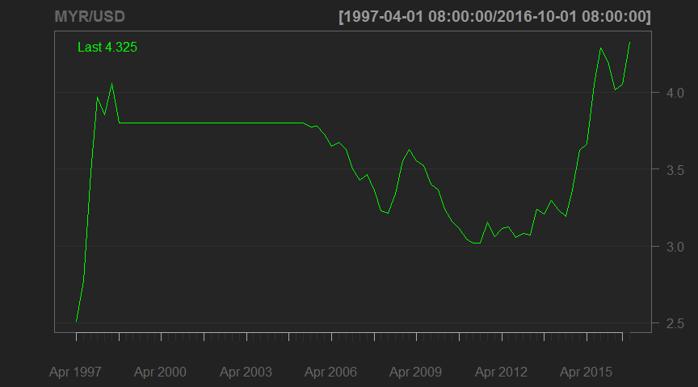
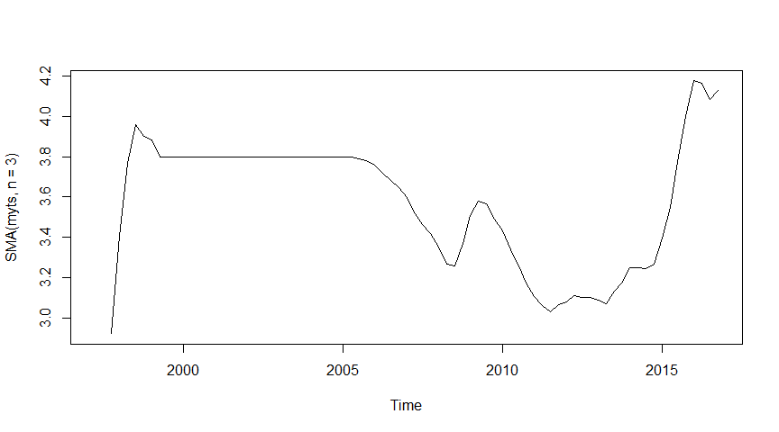
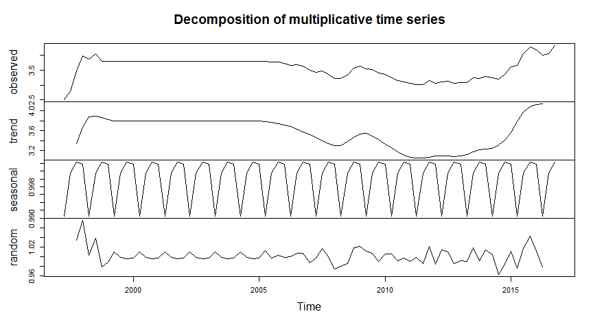

# Forecasting Foreign Exchange Rate Trend with Exponential Smoothing (ETS)
Author: Poo, L. S.  
Date: `r format(Sys.Date(), '%d %B %Y')`  

## Reading Data


```r
library(quantmod)
library(forecast)
library(plotly)

myforex <- read.table("forex.txt",
                      header = TRUE)
myts <- ts(myforex,
           start = c(1997, 2),
           frequency = 4)
myts
```

```
##        Qtr1   Qtr2   Qtr3   Qtr4
## 1997        2.5079 2.7747 3.4786
## 1998 3.9684 3.8534 4.0549 3.8000
## 1999 3.8000 3.8000 3.8000 3.8000
## 2000 3.8000 3.8000 3.8000 3.8000
## 2001 3.8000 3.8000 3.8000 3.8000
## 2002 3.8000 3.8000 3.8000 3.8000
## 2003 3.8000 3.8000 3.8000 3.8000
## 2004 3.8000 3.8000 3.8000 3.8000
## 2005 3.8000 3.8000 3.7715 3.7766
## 2006 3.7256 3.6479 3.6720 3.6250
## 2007 3.4986 3.4283 3.4665 3.3578
## 2008 3.2257 3.2120 3.3369 3.5551
## 2009 3.6273 3.5511 3.5220 3.4018
## 2010 3.3668 3.2410 3.1578 3.1146
## 2011 3.0470 3.0188 3.0209 3.1523
## 2012 3.0603 3.1153 3.1247 3.0575
## 2013 3.0811 3.0703 3.2384 3.2092
## 2014 3.2980 3.2354 3.1934 3.3665
## 2015 3.6217 3.6621 4.0493 4.2856
## 2016 4.1954 4.0133 4.0514 4.3250
```

## Chart Series


```r
chartSeries(myts,
            name = "MYR/USD")
```

<!-- -->

## Simple Moving Average (Average Over 3 Periods)


```r
plot(SMA(myts,
         n = 3))
```

<!-- -->

## Decomposition


```r
plot(decompose(myts,
               type = "multiplicative"))
```

<!-- -->

## ETS Model (Multiplicative Error, Multiplicative Trend, Multiplicative Season)


```r
myets <- ets(myts,
             model = "MMM")
myets
```

```
## ETS(M,Md,M) 
## 
## Call:
##  ets(y = myts, model = "MMM") 
## 
##   Smoothing parameters:
##     alpha = 0.9645 
##     beta  = 0.0945 
##     gamma = 0.0225 
##     phi   = 0.8 
## 
##   Initial states:
##     l = 2.1051 
##     b = 1.241 
##     s=1.0038 1.0065 0.9981 0.9916
## 
##   sigma:  0.0336
## 
##      AIC     AICc      BIC 
## 29.51587 32.75117 53.21035
```

## Forecast


```r
myfcast <- forecast(myets,
                    level = 95)
plot_ly() %>%
    add_lines(x = time(myfcast$x),
              y = myfcast$x,
              color = I("black"),
              name = "Observed Data",
              line = list(width = 2)) %>%
    add_lines(x = time(myfcast$fitted),
              y = myfcast$fitted,
              color = I("red"),
              name = "Fitted Model",
              line = list(width = 1)) %>%
    add_lines(x = time(myfcast$mean),
              y = myfcast$mean,
              color = I("blue"),
              name = "Forecast",
              line = list(width = 2)) %>%
    add_ribbons(x = time(myfcast$mean),
                ymin = myfcast$lower,
                ymax = myfcast$upper,
                color = I("gray"),
                name = "95% Confidence") %>%
    layout(title = paste("Foreign Exchange Rate Trend Forecast for MYR/USD with",
                         myets$method),
           xaxis = list(title = "Year"),
           yaxis = list(title = "Foreign Exchange Rate (MYR/USD)"))
```

<!--html_preserve--><div id="htmlwidget-bfdd96cafbd54f428750" style="width:864px;height:480px;" class="plotly html-widget"></div>
<script type="application/json" data-for="htmlwidget-bfdd96cafbd54f428750">{"x":{"layout":{"margin":{"b":40,"l":60,"t":25,"r":10},"title":"Foreign Exchange Rate Trend Forecast for MYR/USD with ETS(M,Md,M)","xaxis":{"domain":[0,1],"title":"Year"},"yaxis":{"domain":[0,1],"title":"Foreign Exchange Rate (MYR/USD)"}},"source":"A","config":{"modeBarButtonsToAdd":[{"name":"Collaborate","icon":{"width":1000,"ascent":500,"descent":-50,"path":"M487 375c7-10 9-23 5-36l-79-259c-3-12-11-23-22-31-11-8-22-12-35-12l-263 0c-15 0-29 5-43 15-13 10-23 23-28 37-5 13-5 25-1 37 0 0 0 3 1 7 1 5 1 8 1 11 0 2 0 4-1 6 0 3-1 5-1 6 1 2 2 4 3 6 1 2 2 4 4 6 2 3 4 5 5 7 5 7 9 16 13 26 4 10 7 19 9 26 0 2 0 5 0 9-1 4-1 6 0 8 0 2 2 5 4 8 3 3 5 5 5 7 4 6 8 15 12 26 4 11 7 19 7 26 1 1 0 4 0 9-1 4-1 7 0 8 1 2 3 5 6 8 4 4 6 6 6 7 4 5 8 13 13 24 4 11 7 20 7 28 1 1 0 4 0 7-1 3-1 6-1 7 0 2 1 4 3 6 1 1 3 4 5 6 2 3 3 5 5 6 1 2 3 5 4 9 2 3 3 7 5 10 1 3 2 6 4 10 2 4 4 7 6 9 2 3 4 5 7 7 3 2 7 3 11 3 3 0 8 0 13-1l0-1c7 2 12 2 14 2l218 0c14 0 25-5 32-16 8-10 10-23 6-37l-79-259c-7-22-13-37-20-43-7-7-19-10-37-10l-248 0c-5 0-9-2-11-5-2-3-2-7 0-12 4-13 18-20 41-20l264 0c5 0 10 2 16 5 5 3 8 6 10 11l85 282c2 5 2 10 2 17 7-3 13-7 17-13z m-304 0c-1-3-1-5 0-7 1-1 3-2 6-2l174 0c2 0 4 1 7 2 2 2 4 4 5 7l6 18c0 3 0 5-1 7-1 1-3 2-6 2l-173 0c-3 0-5-1-8-2-2-2-4-4-4-7z m-24-73c-1-3-1-5 0-7 2-2 3-2 6-2l174 0c2 0 5 0 7 2 3 2 4 4 5 7l6 18c1 2 0 5-1 6-1 2-3 3-5 3l-174 0c-3 0-5-1-7-3-3-1-4-4-5-6z"},"click":"function(gd) { \n        // is this being viewed in RStudio?\n        if (location.search == '?viewer_pane=1') {\n          alert('To learn about plotly for collaboration, visit:\\n https://cpsievert.github.io/plotly_book/plot-ly-for-collaboration.html');\n        } else {\n          window.open('https://cpsievert.github.io/plotly_book/plot-ly-for-collaboration.html', '_blank');\n        }\n      }"}],"modeBarButtonsToRemove":["sendDataToCloud"]},"data":[{"x":[1997.25,1997.5,1997.75,1998,1998.25,1998.5,1998.75,1999,1999.25,1999.5,1999.75,2000,2000.25,2000.5,2000.75,2001,2001.25,2001.5,2001.75,2002,2002.25,2002.5,2002.75,2003,2003.25,2003.5,2003.75,2004,2004.25,2004.5,2004.75,2005,2005.25,2005.5,2005.75,2006,2006.25,2006.5,2006.75,2007,2007.25,2007.5,2007.75,2008,2008.25,2008.5,2008.75,2009,2009.25,2009.5,2009.75,2010,2010.25,2010.5,2010.75,2011,2011.25,2011.5,2011.75,2012,2012.25,2012.5,2012.75,2013,2013.25,2013.5,2013.75,2014,2014.25,2014.5,2014.75,2015,2015.25,2015.5,2015.75,2016,2016.25,2016.5,2016.75],"y":[2.5079,2.7747,3.4786,3.9684,3.8534,4.0549,3.8,3.8,3.8,3.8,3.8,3.8,3.8,3.8,3.8,3.8,3.8,3.8,3.8,3.8,3.8,3.8,3.8,3.8,3.8,3.8,3.8,3.8,3.8,3.8,3.8,3.8,3.8,3.7715,3.7766,3.7256,3.6479,3.672,3.625,3.4986,3.4283,3.4665,3.3578,3.2257,3.212,3.3369,3.5551,3.6273,3.5511,3.522,3.4018,3.3668,3.241,3.1578,3.1146,3.047,3.0188,3.0209,3.1523,3.0603,3.1153,3.1247,3.0575,3.0811,3.0703,3.2384,3.2092,3.298,3.2354,3.1934,3.3665,3.6217,3.6621,4.0493,4.2856,4.1954,4.0133,4.0514,4.325],"type":"scatter","mode":"lines","name":"Observed Data","line":{"fillcolor":"rgba(0,0,0,1)","color":"rgba(0,0,0,1)","width":2},"xaxis":"x","yaxis":"y"},{"x":[1997.25,1997.5,1997.75,1998,1998.25,1998.5,1998.75,1999,1999.25,1999.5,1999.75,2000,2000.25,2000.5,2000.75,2001,2001.25,2001.5,2001.75,2002,2002.25,2002.5,2002.75,2003,2003.25,2003.5,2003.75,2004,2004.25,2004.5,2004.75,2005,2005.25,2005.5,2005.75,2006,2006.25,2006.5,2006.75,2007,2007.25,2007.5,2007.75,2008,2008.25,2008.5,2008.75,2009,2009.25,2009.5,2009.75,2010,2010.25,2010.5,2010.75,2011,2011.25,2011.5,2011.75,2012,2012.25,2012.5,2012.75,2013,2013.25,2013.5,2013.75,2014,2014.25,2014.5,2014.75,2015,2015.25,2015.5,2015.75,2016,2016.25,2016.5,2016.75],"y":[2.48097380872005,2.8995102689744,3.12190623450669,3.80100635408406,4.2382875367236,4.11357889208209,4.29088241777067,3.90386081835057,3.81996565970028,3.88537436255128,3.87992753447975,3.81992186742573,3.76462645859922,3.84201771763664,3.8497800454136,3.79974612060439,3.75054002657976,3.82892106610979,3.8414293760501,3.79508900763768,3.74750977709889,3.82401750550242,3.83892817417411,3.79460006776143,3.74746995709703,3.82137976088267,3.83798375432678,3.79521622797136,3.74824060880231,3.81940491203293,3.83743671472949,3.79610819066133,3.74923075577035,3.81765790272527,3.80707331352567,3.7722084181179,3.67397123195315,3.65598782799008,3.70178280491506,3.61627278588135,3.44338785175928,3.42941379497554,3.48782430622189,3.34362275818357,3.17095339665317,3.21138050814487,3.35706574868787,3.55963524347764,3.602591697699,3.5804462295612,3.55635715244743,3.39255046807178,3.31995514792136,3.24725198522198,3.16848208251489,3.09653878875194,2.99555047192472,3.02098378371357,3.03515540290767,3.14646978380818,3.02308775719355,3.12952610430684,3.15403830604133,3.04787545518804,3.04671611834378,3.08189327644168,3.27156289029914,3.21190193027659,3.2722264328062,3.25868713551558,3.2162216533735,3.37126246584505,3.602881794164,3.70670598930339,4.12387587825006,4.33907639375899,4.1834971922779,4.06000171041195,4.09032527516885],"type":"scatter","mode":"lines","name":"Fitted Model","line":{"fillcolor":"rgba(255,0,0,1)","color":"rgba(255,0,0,1)","width":1},"xaxis":"x","yaxis":"y"},{"x":[2017,2017.25,2017.5,2017.75,2018,2018.25,2018.5,2018.75],"y":[4.33839121756462,4.31204171877287,4.36637722899083,4.42022047989472,4.42264756244471,4.37890837236666,4.42046119849858,4.4639672628147],"type":"scatter","mode":"lines","name":"Forecast","line":{"fillcolor":"rgba(0,0,255,1)","color":"rgba(0,0,255,1)","width":2},"xaxis":"x","yaxis":"y"},{"x":[2017,2017.25,2017.5,2017.75,2018,2018.25,2018.5,2018.75,2018.75,2018.75,2018.5,2018.25,2018,2017.75,2017.5,2017.25,2017],"type":"scatter","mode":"lines","hoveron":"points","fill":"toself","name":"95% Confidence","y":[4.04634934053341,3.89767492187534,3.85689435202028,3.79980326892363,3.71120151168274,3.61744553552707,3.57083574178453,3.57403956208946,3.57403956208946,5.46679683699365,5.34223384325622,5.20932505357259,5.17164314801894,5.07073843827209,4.8833044346792,4.72595995332226,4.62188465837199],"line":{"fillcolor":"rgba(190,190,190,1)","color":"rgba(190,190,190,1)"},"xaxis":"x","yaxis":"y"}],"base_url":"https://plot.ly"},"evals":["config.modeBarButtonsToAdd.0.click"],"jsHooks":[]}</script><!--/html_preserve-->

## Accuracy


```r
accuracy(myfcast)
```

```
##                       ME      RMSE        MAE        MPE     MAPE
## Training set -0.00600135 0.1235529 0.08394936 -0.1831468 2.338083
##                   MASE      ACF1
## Training set 0.4690922 0.1913539
```

***DISCLAIMER: This article is for educational purposes only. The data and forecast accuracies are not guaranteed.***
